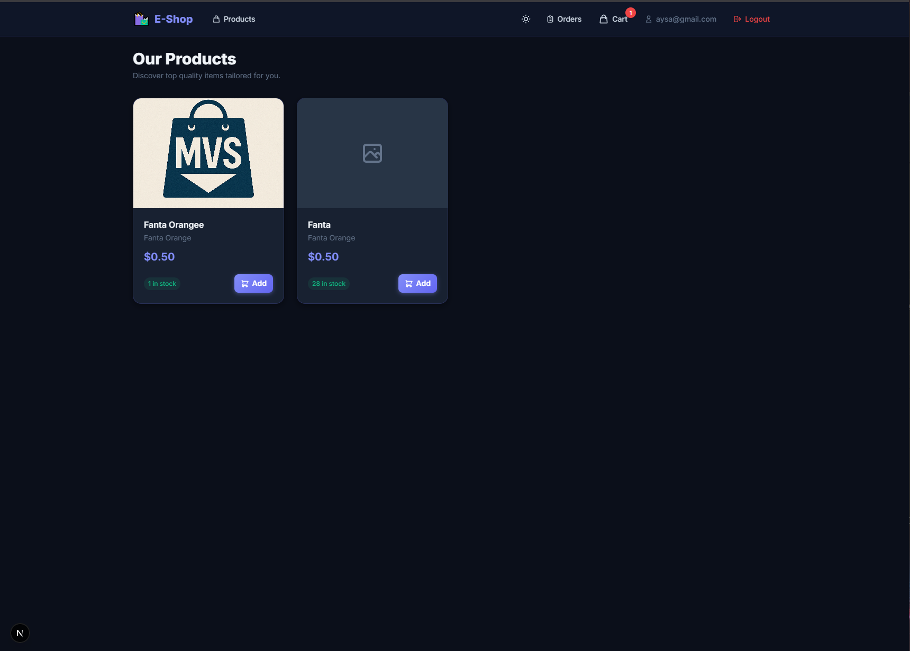
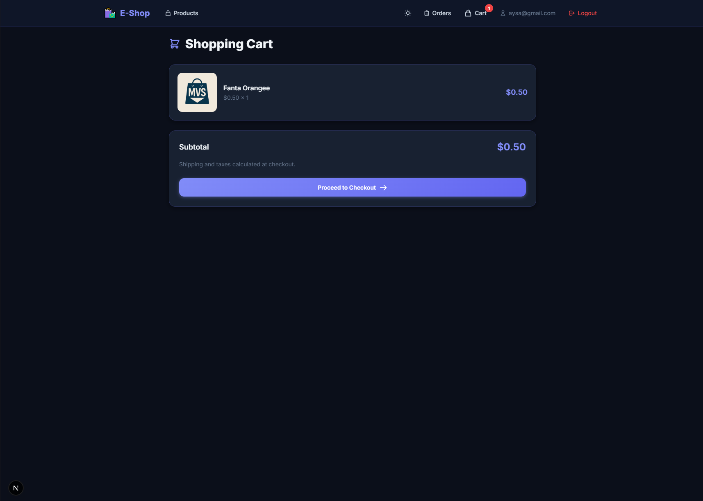

# Fullstack E-Commerce Platform

 <!-- Ganti link gambar ini nanti -->

A modern, full-stack e-commerce web application with user authentication, product management, shopping cart, and secure checkout integration. 

## ✨ Features

- **User Authentication**: Secure login and registration using JWT.
- **Product Catalog**: Browse, search, and filter products.
- **Shopping Cart**: Add, remove, and manage items in the cart.
- **Secure Checkout**: Integrated with Stripe for secure payment processing.
- **Responsive Design**: Optimized for both desktop and mobile devices.

## 📸 Screenshots

| Home Page | Product Details | Shopping Cart |
| :---: | :---: | :---: |
|  |  |  |

## 🛠️ Tech Stack

**Frontend:**
- Next.js / React
- Tailwind CSS (atau styling yang Anda gunakan)
- Axios / Fetch API

**Backend:**
- Node.js & Express.js
- PostgreSQL (Database)
- Prisma / Sequelize (ORM)
- JSON Web Tokens (JWT)
- Stripe (Payment Gateway)

## 🚀 Getting Started

Follow these instructions to set up the project locally on your machine.

### Prerequisites
- [Node.js](https://nodejs.org/) (v16 or higher)
- [PostgreSQL](https://www.postgresql.org/)
- Stripe Account (for payment gateway)

### Installation

1. **Clone the repository**
   ```bash
   git clone https://github.com/username/fullstack-ecommerce.git
   cd fullstack-ecommerce
   ```

2. **Setup Backend**
   ```bash
   cd ecommerce-backend
   npm install
   ```
   - Copy `.env.example` to `.env` and fill in your database and Stripe credentials.
   - Run database migrations (jika ada).
   - Start the server:
     ```bash
     npm run dev
     ```

3. **Setup Frontend**
   ```bash
   cd ../ecommerce-frontend
   npm install
   ```
   - Copy `.env.local.example` to `.env.local` (jika ada) dan sesuaikan URL backend.
   - Start the frontend application:
     ```bash
     npm run dev
     ```

## ⚙️ Environment Variables

To run this project, you will need to add the following environment variables to your `.env` file in the backend folder. You can look at the `.env.example` file for reference.

`DATABASE_URL`
`JWT_SECRET`
`PORT`
`STRIPE_SECRET_KEY`
`STRIPE_WEBHOOK_SECRET`
`FRONTEND_URL`

## 🤝 Contributing

Contributions, issues, and feature requests are welcome!

## 📝 License

This project is [MIT](https://choosealicense.com/licenses/mit/) licensed.
